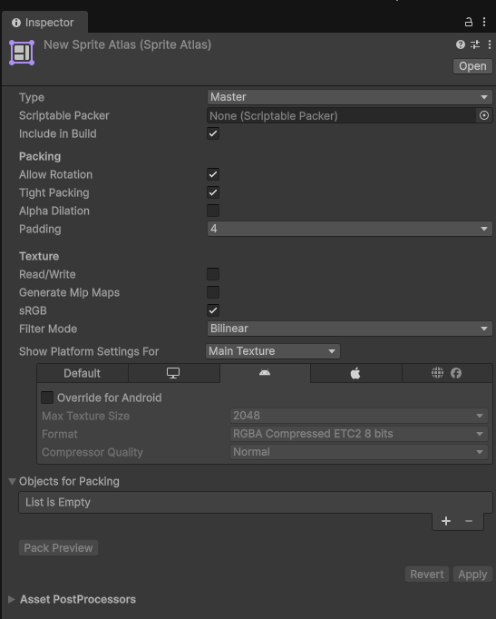

# Sprites & Atlases

> **Target: Unity 6.3 LTS (6000.3)** · URP only · **2D**. Sprite là texture với Texture Type = `Sprite (2D and UI)`. **Sprite Atlas** gom nhiều sprite vào 1 texture → ít material switch → **ít draw call**.

!!! abstract "TL;DR"
    - Ảnh 2D đặt **Texture Type = `Sprite (2D and UI)`**.
    - **Sprite Mode:** `Single` (1 sprite/ảnh) hoặc `Multiple` (sprite sheet → cắt bằng Sprite Editor).
    - **Pixels Per Unit (PPU):** quy đổi pixel → world unit; nhất quán toàn dự án.
    - **Pixel art:** Filter Mode = **Point (no filter)**, Compression = **None**.
    - **Sprite Atlas** (`Create > 2D > Sprite Atlas`) → gộp sprite cùng atlas, giảm draw call.

## :material-cog: Import settings cho sprite

| Field | Ý nghĩa | Gợi ý |
|---|---|---|
| **Texture Type** | Vai trò ảnh | `Sprite (2D and UI)` |
| **Sprite Mode** | 1 hay nhiều sprite | `Single` / `Multiple` (sprite sheet) |
| **Pixels Per Unit** | Pixel trên 1 world unit | Thống nhất (vd 100); pixel art hay dùng 16/32 |
| **Filter Mode** | Lọc khi scale | **Point** cho pixel art, Bilinear cho ảnh mượt |
| **Compression** | Mức nén | **None** cho pixel art; Normal cho ảnh thường |
| **Generate Mipmaps** | Bản thu nhỏ | **Off** cho sprite/UI |

!!! tip "Pixel-perfect art"
    Pixel art: **Filter = Point**, **Compression = None**, PPU = đúng kích thước grid. Cân nhắc package **2D Pixel Perfect** / Pixel Perfect Camera để tránh méo pixel.

## :material-grid: Sprite Atlas

- Tạo: `Assets > Create > 2D > Sprite Atlas`.
- Kéo các sprite / thư mục vào **Objects for Packing**.
- Khi build/play, Unity đóng gói chúng vào 1 texture → các sprite cùng atlas **batch chung**, giảm draw call & SetPass.

{ width="480" }

!!! note "Để ý trong ảnh (click để phóng to)"
    **Type = Master** (atlas chính; còn loại *Variant*). Mục **Packing**: *Allow Rotation* + *Tight Packing* (gói chặt hơn) + *Padding 4*. Mục **Texture** có *Generate Mip Maps* (tắt cho sprite) và **Show Platform Settings For** để đặt format theo platform. **Objects for Packing** là nơi kéo sprite/thư mục vào.

!!! warning "Cần verify"
    Chế độ **Sprite Packer** trong `Project Settings > Editor` (bật đóng gói atlas) nên đối chiếu trực tiếp Editor 6.3.

## :material-flash: Atlas → ít draw call

- Sprite từ **các texture khác nhau** = **không** batch được → mỗi cái 1 draw call.
- Gom vào **cùng atlas** → Unity dùng chung texture → **SRP Batcher / batching** gộp được (xem [Draw Calls & Batching](../rendering/draw-calls-batching.md)).
- Nhóm theo ngữ cảnh: UI 1 atlas, nhân vật 1 atlas, môi trường 1 atlas… để chỉ nạp cái cần.

## :material-flash: Checklist 2D

- [ ] Texture Type = Sprite (2D and UI).
- [ ] PPU nhất quán toàn dự án.
- [ ] Pixel art: Point + Compression None; ảnh mượt: Bilinear.
- [ ] Mipmaps Off cho sprite/UI.
- [ ] Gom sprite hay xuất hiện cùng nhau vào **Sprite Atlas**.

## :material-link-variant: Nguồn

- [Sprites — Unity 6.3 Manual](https://docs.unity3d.com/6000.3/Documentation/Manual/Sprites.html)
- [Sprite Atlas — Unity 6.3 Manual](https://docs.unity3d.com/6000.3/Documentation/Manual/sprite-atlas.html)
