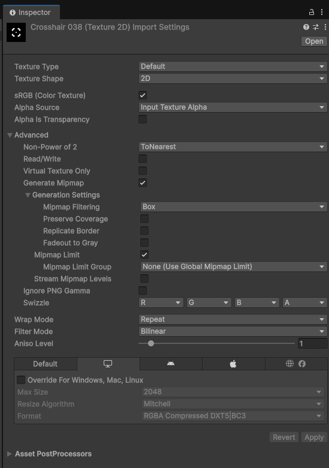
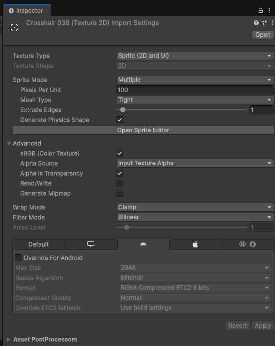

# Textures

> **Target: Unity 6.3 LTS (6000.3)** · URP only. Cấu hình ở **Inspector của file ảnh** (chọn texture trong Project). Texture thường là phần **nặng nhất** của build & RAM.

!!! abstract "TL;DR"
    - **Texture Type** quyết định cách dùng: `Default` (3D), `Sprite (2D and UI)` (2D), `Normal map`…
    - **Nén theo platform** (tab override): **BC7 / DXT** cho **PC**, **ASTC** cho **mobile**.
    - **Max Size** giới hạn độ phân giải — hạ trên mobile để tiết kiệm RAM/băng thông.
    - **Mipmaps:** bật cho 3D (object xa), **tắt** cho sprite/UI 2D.
    - **sRGB:** bật cho ảnh màu (albedo); **tắt** cho data map (normal, mask, roughness).

## :material-cog: Các field chính

| Field | Ý nghĩa | Gợi ý |
|---|---|---|
| **Texture Type** | Cách Unity diễn giải ảnh | `Default` (3D), `Sprite (2D and UI)` (2D), `Normal map` |
| **sRGB (Color Texture)** | Ảnh ở không gian màu gamma | **On** cho albedo/ảnh màu; **Off** cho normal/mask/data |
| **Generate Mipmaps** | Tạo bản thu nhỏ cho object xa | **On** cho 3D; **Off** cho UI/sprite 2D |
| **Max Size** | Trần độ phân giải | Hạ xuống (1024/512) trên mobile |
| **Compression** | Mức nén (None/Low/Normal/High) | `Normal` mặc định; cân nét vs size |
| **Use Crunch Compression** | Nén thêm trên đĩa (build nhỏ hơn) | Tốt để giảm size; tốn thời gian import |

!!! info "Nhóm Advanced"
    Các field như **Non-Power of 2**, **Read/Write**, **Generate Mipmap**, **Swizzle** nằm trong nhóm **Advanced** (xem ảnh phần dưới). **Use Crunch Compression** xuất hiện ở tab platform khi Format hỗ trợ (DXT/ETC), kèm slider **Compressor Quality**.

## :material-tune-variant: Nén theo platform (override)

Trong Inspector texture có hàng tab platform: **Default**, **PC/Standalone**, **Android**, **iOS**… Tick **Override for \<platform\>** để đặt riêng format.

=== "PC / Standalone"
    - **Mặc định:** `RGBA Compressed DXT5|BC3` (xem ảnh dưới).
    - **Khuyến nghị nâng cấp:** **BC7** (chất lượng cao hơn DXT5, cùng cỡ) cho ảnh quan trọng.
    - **BC5** cho normal map (2 kênh, nét).
    - Max Size thoải mái (2048+).

=== "Mobile (Android/iOS)"
    - **Mặc định Android:** `RGBA Compressed ETC2 8 bits`.
    - **Khuyến nghị nâng cấp:** **ASTC** (linh hoạt block size — `ASTC 6x6`/`8x8` cân nét/size) trên thiết bị hiện đại.
    - Block lớn hơn = nén mạnh hơn, nhẹ hơn, kém nét hơn.
    - Hạ **Max Size** (1024/512), bật **Crunch** để giảm size tải về.

!!! tip "Quy tắc nhanh"
    Albedo màu → **BC7 (PC) / ASTC (mobile)** + sRGB On. Normal map → **BC5 (PC) / ASTC** + sRGB Off. Data/mask → sRGB Off.

## :material-image-multiple: Mipmaps

- **Mipmap** = chuỗi bản thu nhỏ; GPU chọn mức theo khoảng cách → **giảm aliasing & tiết kiệm băng thông** cho object xa.
- **Bật** cho texture 3D world.
- **Tắt** cho **sprite 2D / UI** (luôn hiển thị 1:1, mipmap chỉ phí RAM +33% và làm mờ).

Cùng một file ảnh, đổi **Texture Type** là cả Inspector đổi theo. Hai ảnh dưới là cùng 1 crosshair — import dạng **Default (3D)** vs **Sprite (2D)**:

=== "Default (3D)"
    { width="460" }

=== "Sprite (2D)"
    { width="460" }

!!! note "Để ý trong ảnh (click để phóng to)"
    Format **mặc định** không phải BC7/ASTC: PC hiện **DXT5|BC3**, Android hiện **ETC2 8 bits** — BC7/ASTC là lựa chọn nâng cấp bạn tự chọn. Bản **Sprite (2D)** tự tắt **Generate Mipmap** và bày các field sprite (Sprite Mode, Pixels Per Unit) — xem [Sprites & Atlases](sprites-atlases.md).

## :material-flash: Checklist tối ưu

- [ ] Texture Type đúng (Sprite cho 2D, Default cho 3D, Normal map cho normal).
- [ ] sRGB: On cho ảnh màu, Off cho data map.
- [ ] Mipmaps: On (3D) / Off (UI-sprite).
- [ ] Override mobile: ASTC + Max Size thấp hơn PC.
- [ ] Cân nhắc Crunch để giảm dung lượng build.
- [ ] **Power-of-two** size để nén tốt nhất.

## :material-link-variant: Nguồn

- [Texture import settings — Unity 6.3 Manual](https://docs.unity3d.com/6000.3/Documentation/Manual/class-TextureImporter.html)
- [Recommended texture compression formats by platform](https://docs.unity3d.com/6000.3/Documentation/Manual/texture-compression-formats.html)
