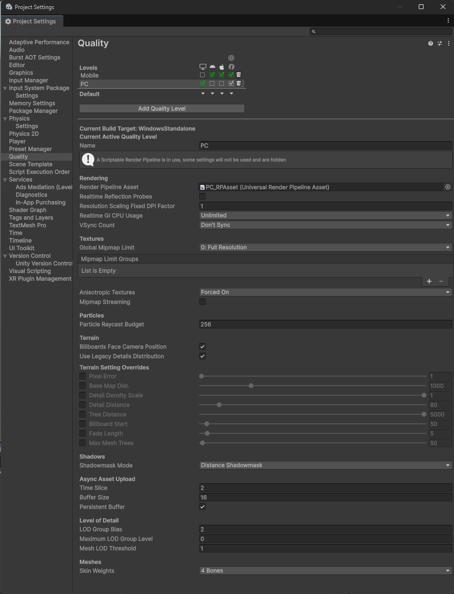
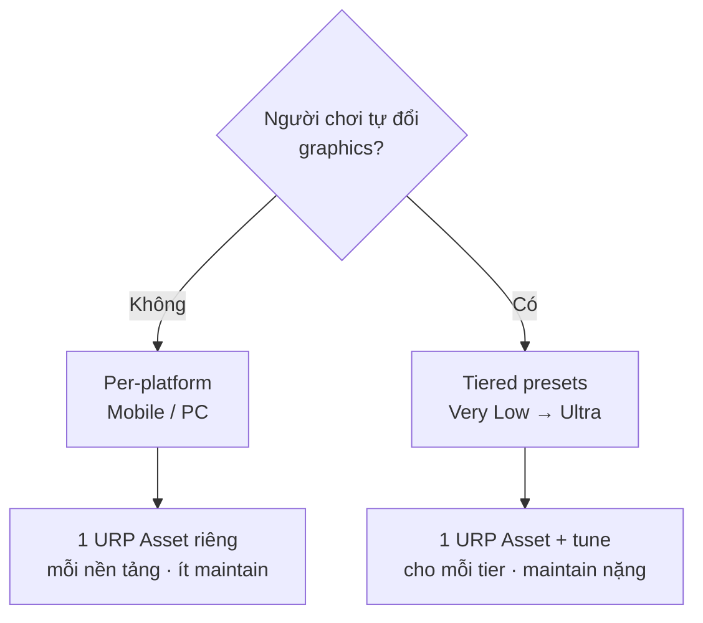

# Quality Settings

> **Target: Unity 6.3 LTS (6000.3)** · URP only. Default value trên trang này lấy từ template **Universal 3D** (`6000.3.10f1`). Field/menu path theo [Quality Settings — Unity 6.3 Manual](https://docs.unity3d.com/6000.3/Documentation/Manual/class-QualitySettings.html).

!!! abstract "TL;DR"
    - **Menu:** `Edit > Project Settings > Quality`.
    - Template **3D** → 2 level **Mobile / PC** (2 URP Asset khác nhau); template **2D** → 6 level **Very Low→Ultra** (1 URP Asset chung).
    - Phần lớn rendering (MSAA, Shadows, Soft Particles) **nằm ở URP Asset**, không phải cửa sổ Quality.
    - Khác biệt Mobile vs PC chủ yếu: **Render Scale 0.8 vs 1.0**, **Shadow Cascades 1 vs 4**, **Soft Shadows off vs on**.

## :material-tune: Mở ở đâu

**Menu path:** `Edit > Project Settings > Quality` — cách chắc chắn nhất. Cửa sổ liệt kê các quality level; chọn một level để xem/sửa field, và đặt level active cho từng platform.

{ width="440" }

!!! note "Để ý trong ảnh (click để phóng to)"
    Dòng *"A Scriptable Render Pipeline is in use, some settings will not be used and are hidden"* xác nhận: dưới URP, nhiều field (Anti Aliasing, Pixel Light Count, Shadows…) bị **ẩn** khỏi cửa sổ Quality — cấu hình thật nằm trong **URP Asset**. Ảnh cũng cho thấy field thật tên **LOD Group Bias** / **Maximum LOD Group Level**.

!!! tip "Đổi nhanh Quality level trên toolbar (Unity 6.3)"
    Control này **ẩn mặc định** — bật qua tùy biến main toolbar:

    1. Bấm **dấu ⋮ (3 chấm)** ở **góc phải trên main toolbar** (cạnh `Layout` / `?`).
    2. Chọn **Editor Utility → Quality** (hoặc *Show All* để hiện hết).

    Sau đó ô **Quality** xuất hiện trên main toolbar — bấm để đổi level, không cần mở Project Settings. (Main toolbar = hàng có nút Play/Pause; *không phải* menu bar File/Edit.) Nguồn: [What's New 6.3](https://docs.unity3d.com/6000.3/Documentation/Manual/WhatsNewUnity63.html).

## :material-layers-triple-outline: Quality levels: template 2D vs 3D KHÁC nhau

2 template tạo **bộ quality level khác nhau**:

=== "Universal 3D"
    **2 level: `Mobile` và `PC`**, mỗi level trỏ một URP Asset riêng qua field **Render Pipeline**:

    | Level | URP Asset | Default cho platform |
    |---|---|---|
    | **Mobile** (0) | `Mobile_RPAsset` | Android, iOS, WebGL… |
    | **PC** (1) | `PC_RPAsset` | Standalone (Win/Mac/Linux), consoles |

    > `m_PerPlatformDefaultQuality`: Android→Mobile, Standalone→PC. Mỗi level `excludedTargetPlatforms` loại nền không liên quan.

=== "Universal 2D"
    **6 level: `Very Low → Low → Medium → High → Very High → Ultra`** — tất cả trỏ **cùng một** URP Asset (`UniversalRP.asset`), không loại platform. Current mặc định: **Very Low**.

!!! note "Bảng default bên dưới = template 3D"
    Các bảng default ở dưới lấy từ **template Universal 3D (Mobile/PC)**. Template **2D** dùng 6 level Very Low→Ultra chung 1 URP Asset — field cùng cấu trúc, tự chỉnh; nguyên tắc tối ưu PC vs Mobile vẫn áp dụng. Riêng 2D ít phụ thuộc shadow/cascade hơn (xem [2D Renderer](../rendering/render-pipeline-urp.md)).

## :material-source-branch: Chọn mô hình quality level: per-platform hay tiered?

Hai template dùng 2 triết lý khác nhau. Tiêu chí chọn gọn lại ở **một câu hỏi: người chơi có được tự đổi graphics không?**



| | **Per-platform** (Mobile/PC — như 3D template) | **Tiered presets** (Very Low→Ultra — như 2D template) |
|---|---|---|
| Mục đích | Quality **cố định theo nền tảng**, build tự chọn đúng level | Người chơi / auto-detect **tự chọn** mức graphics |
| URP Asset | 1 asset **riêng cho mỗi nền** (đã khác nhau sẵn) | Nên 1 asset **riêng cho mỗi tier** (phải tự tạo + tune) |
| Maintain | Nhẹ (2 asset) | Nặng hơn (nhiều asset) |
| Hợp với | Mobile game, game không cho đổi graphics | Game PC có menu "Low/Medium/High/Ultra" |

!!! warning "Bẫy: nhiều level ≠ nhiều mức chất lượng"
    Template 2D có 6 level nhưng **cả 6 trỏ chung 1 URP Asset** → giống hệt nhau cho tới khi bạn tạo URP Asset riêng cho từng tier rồi tune (render scale, shadow, MSAA…). "6 level" không tự nó tạo ra 6 mức chất lượng.

**Muốn cho người chơi đổi graphics (tiered):**

1. Tạo 1 URP Asset cho mỗi tier (vd `URP_Low`, `URP_Medium`, `URP_High`) và tune từng cái.
2. `Project Settings > Quality` → tạo các level, gán URP Asset tương ứng vào field **Render Pipeline**.
3. Runtime đổi bằng code:

    ```csharp
    QualitySettings.SetQualityLevel(2, applyExpensiveChanges: true); // theo index
    // hoặc lấy danh sách tên: var names = QualitySettings.names;
    ```

**Quality cố định theo nền tảng (per-platform):** giữ Mobile/PC như template 3D — gọn, ít maintain. Đây là mặc định Unity chọn cho template 3D.

!!! note "URP điều khiển phần lớn rendering"
    Trong cửa sổ Quality, các field **Anti Aliasing (MSAA), Shadows, Soft Particles, Pixel Light Count** thực tế bị URP "vô hiệu" — cấu hình thật nằm trong **URP Asset** (xem bảng URP Asset bên dưới và [Render Pipeline (URP)](../rendering/render-pipeline-urp.md)). Đó là lý do `antiAliasing` = **0 (Disabled)** ở cả 2 level trong template.

## :material-window-restore: Default value — Quality window

Các field **còn thực sự tác dụng dưới URP**:

| Field | Mobile | PC | Ghi chú |
|---|---|---|---|
| VSync Count | **Don't Sync** (0) | **Don't Sync** (0) | Cả 2 = 0 |
| Anisotropic Textures | **Per Texture** (1) | **Forced On** (2) | |
| Global Mipmap Limit | 0 (Full Res) | 0 (Full Res) | |
| Mipmap Streaming | **Off** | **Off** | Budget 512 MB, 512 renderers/frame, max reduction 2, 1024 IO khi bật |
| LOD Group Bias | **1** | **2** | PC giữ LOD cao xa hơn |
| Maximum LOD Group Level | 0 | 0 | |
| LOD Cross Fade | On (1) | On (1) | |
| Particle Raycast Budget | 256 | 256 | |
| Async Upload Time Slice / Buffer | 2 ms / 16 MB | 2 ms / 16 MB | Persistent Buffer: On |
| Skin Weights | **2 Bones** | **4 Bones** | |
| Realtime Reflection Probes | Off | Off | |
| Realtime GI CPU Usage | 100 (Unlimited) | 100 (Unlimited) | |
| Anti Aliasing (MSAA) | Disabled (0)\* | Disabled (0)\* | \*thực tế dùng URP Asset |

## :material-package-variant-closed: Default value — URP Asset

Đây mới là nơi quyết định rendering (`Mobile_RPAsset` / `PC_RPAsset`):

| URP Asset field | Mobile_RPAsset | PC_RPAsset |
|---|---|---|
| **MSAA** | Disabled | Disabled |
| **Render Scale** | **0.8** | **1.0** |
| HDR | On (32-bit) | On (32-bit) |
| Upscaling Filter | Automatic | Automatic |
| Depth Texture | **Off** | **On** |
| Main Light | Per Pixel, shadows on | Per Pixel, shadows on |
| Main Light Shadow Resolution | **1024** | **2048** |
| Additional Lights | Per Pixel, Per Object Limit 4 | Per Pixel, Per Object Limit 4 |
| Shadow Max Distance | 50 | 50 |
| **Shadow Cascades** | **1** | **4** |
| **Soft Shadows** | **Off** | **On** (High) |
| Color Grading | LDR, LUT 32 | LDR, LUT 32 |

> Field path: `URP Asset > Quality` (HDR, MSAA, Render Scale), `> Lighting` (Main/Additional Lights), `> Shadows` (Max Distance, Cascades, Soft Shadows). Chi tiết: [Render Pipeline (URP)](../rendering/render-pipeline-urp.md).

## :material-lightbulb-on-outline: Đọc bảng trên thế nào (PC vs Mobile)

> Unity đã tune sẵn 2 preset hợp lý. Hiểu **tại sao** để biết khi nào nên đổi.

=== "PC"

    Template để PC "ăn chắc chất lượng":

    - **Render Scale 1.0** — render full res, GPU desktop dư.
    - **Shadow Cascades 4 + Soft Shadows On + shadowmap 2048** — bóng đẹp, tầm xa.
    - **Anisotropic Forced On**, **LOD Bias 2** (giữ mesh nét xa hơn), **Skin Weights 4**.
    - **Depth Texture On** — nhiều effect (SSAO…) cần.

    **Có thể đổi:** muốn cạnh mượt hơn → bật **MSAA 2x/4x** trong `PC_RPAsset > Quality` (template để Disabled). Muốn tránh tearing → VSync **Every V Blank** (template để Don't Sync, hợp cho game cap fps).

=== "Mobile"

    Template cắt giảm cho tile-based GPU / nhiệt / pin:

    - **Render Scale 0.8** — render ~64% số pixel rồi upscale → nhẹ fillrate (đòn bẩy lớn nhất trên mobile).
    - **Shadow Cascades 1 + Soft Shadows Off + shadowmap 1024** — shadow rẻ.
    - **Depth Texture Off** — tiết kiệm bandwidth (bật lại nếu shader cần).
    - **Anisotropic Per Texture** (không Forced), **LOD Bias 1** (xuống LOD thấp sớm), **Skin Weights 2**.

    **Có thể đổi:** kiểm soát fps bằng `Application.targetFrameRate` thay vì VSync. Nếu vẫn nặng → hạ Render Scale tiếp (0.7) hoặc bật **FSR 1.0** ở Upscaling Filter.

!!! tip "Đòn bẩy tối ưu mobile theo thứ tự"
    1) **Render Scale** ↓ · 2) **Shadow** (cascades/distance/soft off) · 3) **Depth/Opaque Texture** off · 4) **MSAA** off · 5) Additional Lights Per Vertex / giảm Per Object Limit.

## :material-code-tags: Code: set runtime theo platform

=== "PC"
    ```csharp
    QualitySettings.vSyncCount = 1;          // Every V Blank (tránh tearing)
    ```

=== "Mobile"
    ```csharp
    Application.targetFrameRate = 60;        // hoặc 30 để tiết kiệm pin
    QualitySettings.vSyncCount = 0;          // Don't Sync — control fps bằng targetFrameRate
    ```

## :material-link-variant: Nguồn

- **Nguồn dữ liệu:** template **Universal 3D** `6000.3.10f1` — `ProjectSettings/QualitySettings.asset`, `Assets/Settings/PC_RPAsset.asset`, `Assets/Settings/Mobile_RPAsset.asset`.
- [Quality Settings — Unity 6.3 Manual](https://docs.unity3d.com/6000.3/Documentation/Manual/class-QualitySettings.html)
- [URP Asset reference — Unity 6.3](https://docs.unity3d.com/6000.3/Documentation/Manual/urp/universalrp-asset.html)
- [What's New in Unity 6.3](https://docs.unity3d.com/6000.3/Documentation/Manual/WhatsNewUnity63.html)
