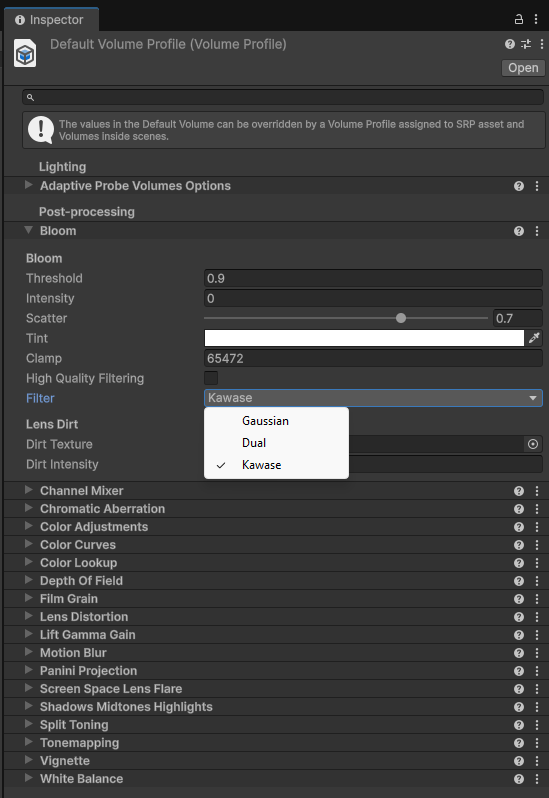

# Post-processing

> **Target: Unity 6.3 LTS (6000.3)** · URP only. URP dùng **Volume framework** cho post-processing (không phải Post Process Stack v2 cũ).

!!! abstract "TL;DR"
    - Post effect đặt trong **Volume Profile** (Global/Local Volume) + camera bật **Post Processing**.
    - **Mới ở 6.3:** Bloom có **Kawase** và **Dual filtering** → nhẹ hơn, tốt cho **low-end / mobile**.
    - **Mobile:** dùng dè post effect (Bloom, DoF, SSAO tốn fillrate); ưu tiên Kawase/Dual bloom.

## :material-image-filter-vintage: Volume framework

- **Volume** (component) + **Volume Profile** (asset chứa các override effect): Bloom, Tonemapping, Color Adjustments, Vignette, Depth of Field…
- **Global Volume:** áp toàn scene. **Local Volume:** chỉ trong collider (blend theo khoảng cách).
- **Camera** phải bật **Post Processing** (và Anti-aliasing per-camera) để effect hiển thị.
- Asset **URP Post-process Data** (tạo qua `Create > Rendering > URP Post-process Data`) gắn với renderer.

{ width="520" }

!!! note "Để ý trong ảnh (click để phóng to)"
    Trong override **Bloom**, field **Filter** là dropdown 3 lựa chọn: **Gaussian** (mặc định cũ), **Dual**, **Kawase**. Có thêm toggle **High Quality Filtering**. Các field khác: *Threshold*, *Intensity*, *Scatter*, *Tint*, *Clamp*, *Lens Dirt*.

## :material-blur: Bloom — Kawase / Dual filtering (mới 6.3)

URP 6.3 thêm hai chế độ **Filter** cho Bloom là **Kawase** và **Dual** (cạnh **Gaussian** cũ) → cải thiện hiệu năng, đặc biệt phần cứng yếu / mobile. Đổi ở field **Filter** trong override Bloom (xem ảnh trên). (Nguồn: [What's New 6.3](https://docs.unity3d.com/6000.3/Documentation/Manual/WhatsNewUnity63.html).)

## :material-flash: Tối ưu theo platform

=== "PC"
    - Thoải mái hơn với Bloom, Tonemapping, Color Grading, DoF.
    - Vẫn nên đo cost từng effect bằng [Profiler](../profiling/tools.md).

=== "Mobile"
    - **Mỗi post effect = full-screen pass** → tốn **bandwidth/fillrate**. Dùng tối thiểu.
    - Bloom: chọn **Kawase / Dual filtering** thay vì bloom mặc định nặng.
    - Tránh **Depth of Field**, **SSAO**, **Motion Blur** trừ khi thật cần.
    - Cân nhắc tắt post hoàn toàn ở quality level thấp.

!!! tip "On Tile Post Processing (XR)"
    6.3 còn có "On Tile Post Processing" tối ưu cho XR — không cốt lõi cho 2D/3D mobile thường, nhưng đáng biết nếu làm XR.

## :material-link-variant: Nguồn

- [What's New in Unity 6.3](https://docs.unity3d.com/6000.3/Documentation/Manual/WhatsNewUnity63.html)
- [Post-processing in URP — Unity 6.3](https://docs.unity3d.com/6000.3/Documentation/Manual/urp/integration-with-post-processing.html)
